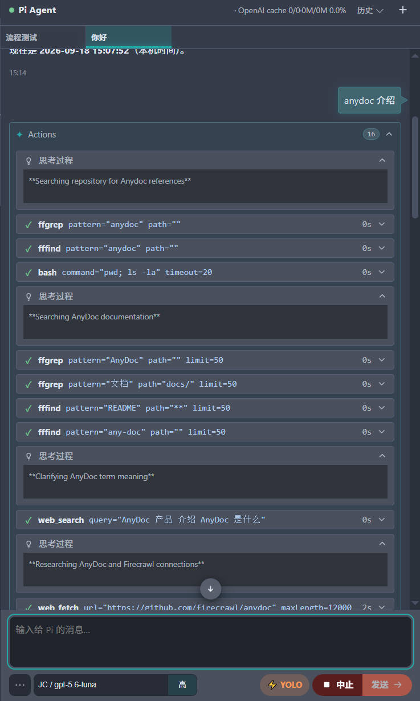
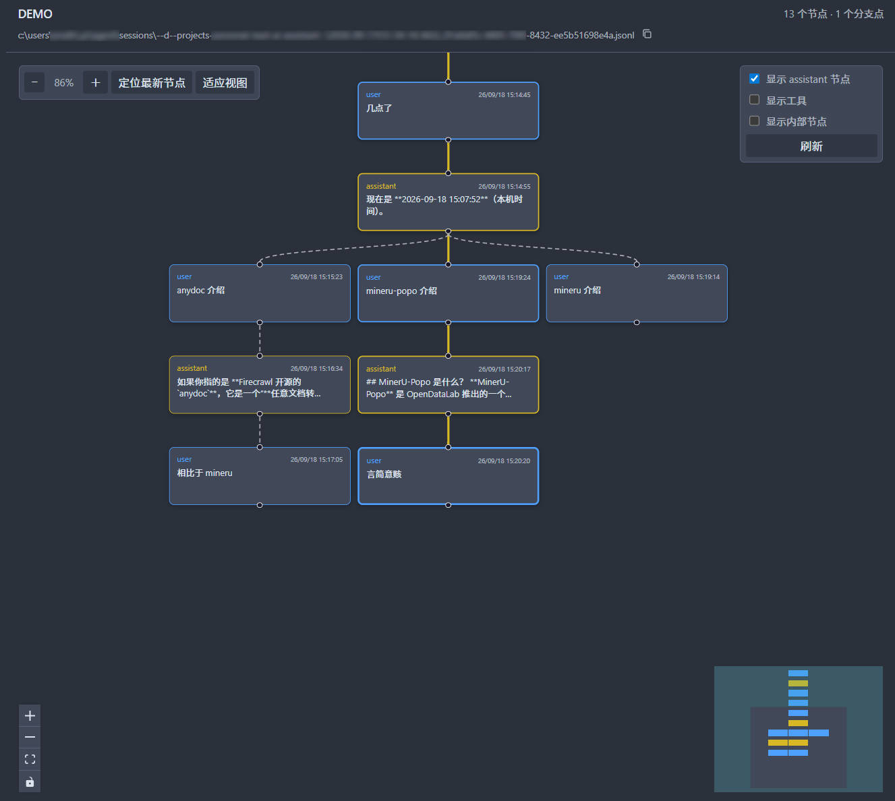

# Pi for VS Code

  

一个将 [Pi coding agent](https://github.com/earendil-works/pi) 集成到 VS Code 活动栏的扩展。

Pi for VS Code 提供专注的侧边栏聊天界面，让你可以在保留编辑器、Explorer、源代码管理和项目上下文的同时使用 Pi。

## 截图

### 聊天界面

### 会话树

[English](README.md)

## 功能

- 在 VS Code 侧边栏中与 Pi 对话。
- 创建和切换可持久化的 Pi 会话。
- 将编辑器选区和 Explorer 路径发送给 Pi。
- 在 Pi 工作期间排队后续提示，或引导正在进行的回复。
- 查看工具活动、确认请求、问题和任务进度。
- 浏览 Pi 会话树，并切换到较早的分支。
- 根据暂存的 Git 更改生成提交信息。
- 跟随 VS Code 的显示语言。

## 安装

从 [Visual Studio Marketplace](https://marketplace.visualstudio.com/items?itemName=boki.pivs) 安装 **Pi for VS Code**。

你还需要安装并配置可用的 Pi，包括模型和 API Key。

更多信息请参阅 [Pi 文档](https://github.com/earendil-works/pi)。

## 使用说明

1. 安装并配置 [Pi](https://github.com/earendil-works/pi)，包括模型和 API Key。
2. 从 Marketplace 安装 **Pi for VS Code**。
3. 在 VS Code 活动栏中打开 **Pi** 视图。
4. 输入提示并提交，开始一个会话。

可以通过命令面板使用以下命令：

- `pivs: Open Chat` — 打开或聚焦 Pi 聊天界面。
- `pivs: New Session` — 创建一个独立的持久化会话。

### 添加上下文

使用以下快捷键将上下文发送到聊天输入框：

- Windows 和 Linux：在编辑器中按 `Ctrl+J`，发送当前选区。
- macOS：在编辑器中按 `Cmd+J`，发送当前选区。
- Windows 和 Linux：在 Explorer 中按 `Ctrl+J`，发送选中的文件或文件夹路径。
- macOS：在 Explorer 中按 `Cmd+J`，发送选中的文件或文件夹路径。

编辑器和 Explorer 的右键菜单中也提供相同操作。

### Pi 工作期间继续操作

- 按 `Enter`，将后续提示加入队列，在当前回复完成后执行。
- Windows 和 Linux 按 `Ctrl+Enter`，macOS 按 `Cmd+Enter`，引导正在进行的回复。

### 设置

在 VS Code 设置中搜索 `PiVS`，可以配置通知、Pi 资源目录、启用的工具、会话标签页、界面圆角和 AI Git 提交行为。

## 项目状态

Pi for VS Code 目前仍处于早期开发阶段。

扩展目前可以使用，但尚未达到成熟状态。不同版本之间的功能、行为和用户界面可能会发生变化。

如果遇到问题或有功能建议，请在本仓库中提交 Issue。反馈问题时，请尽量包含：

- VS Code 版本
- 操作系统
- 扩展版本
- Pi 版本
- 问题复现步骤

请勿在 Issue 中提交 API Key、Token、密码或其他敏感信息。

## 源码

源码目前暂未公开。

本仓库目前用于提供项目介绍、文档、版本发布信息和支持资源。未来可能会在这里公开源码，但目前没有确定的公开时间或承诺。

## 免责声明

Pi for VS Code 是一个独立项目，与 Pi 项目及其维护者没有隶属、合作或官方认可关系。
由于 Pi 支持高度灵活的扩展机制，Pi for VS Code 无法保证与所有 Pi 扩展兼容。

## 许可证

本扩展遵循 [MIT License](LICENSE) 发布。
